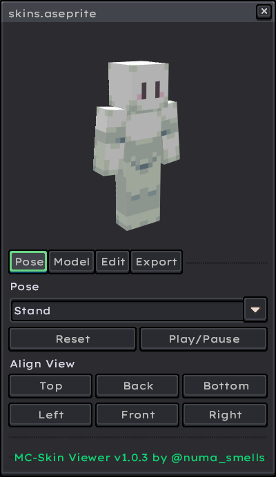
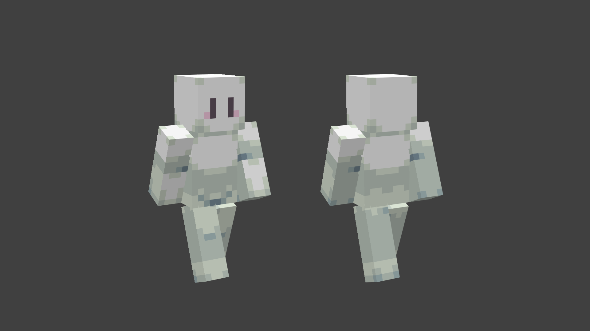

# Aseprite MC-Skin Viewer 

An aseprite plugin-extension to preview Minecraft Skins. Reduces the need for using external programs and includes tools to make skin creation easier.

## Installation

1. [Dowload the extension in the latest release.](https://github.com/numa-smells/Aseprite-MC-Skin-Viewer/releases/mcskin-viewer.aseprite-extension)

2. Double-click the file to install.

3. In Aseprite, Go to `Edit > Preferences > Extensions` and click the `Add Extension` button.

4. Navigate to and select the downloaded file.

## Usage
In Aseprite, open any Minecraft skin sprite. Then, go to `View > MC Skin Viewer` to open the preview window.

> [!IMPORTANT]
> The sprite canvas must be 64 x 64 pixels to be considered a valid Minecraft skin. HD Skins are currently not supported. 

The extension may ask permission to read `mirrormap.png` and `mirrormap_slim.png` when starting up for the first time. This is required for the mirror draw feature.

## Features

### Preview
- `RMB + Drag:` Rotate the model.
- `LMB + Drag:` Move the model.

### Pose
- `Pose:` Select the pose/animation displayed by the model.
- `Reset:` Resets the camera and pose.
- `Play/Pause:` Play or pause the pose animation.
- `Align View:` Snap the camera to view the model the given options.

### Model
- `Model Type:` Select wether the skin type read as Classic (4px arms), Slim (3px arms), or Auto.

- `Toggle Overlay Layers:` Toggle visibility on the skin's 2nd layer.

### Edit

- `Mirror Draw:` When ticked on, changes are mirrored along the vertical axis.

- `Copy:` Copies from the selected body part to a different part. If the sizes are different, it will stretch the image to fit.

- `Flip:` If only `Copy From` is selected, it will flip that part's texture in place. If a `Paste To` is specified, then it will copy over a flip image to the part destination.

### Export

- `Background Color`: Sets the background color in the preview image. This is gray by default.
- `Export Preview:`: Renders and opens a preview image in the Aseprite folder. Convenient for sharing with others. 

> [!NOTE]
> Will ask for permission when ran for the first time.

 

## Contributing
1. Fork the repository.
2. Create a new branch: `git checkout -b feature-name`
3. Make your changes.
4. Push your branch: `git push origin feature-name`
5. Create a pull request.

> [!TIP]
> > You can install the repository directly into your Aseprite extensions folder for easier testing. In Windows you can find it in `%appdata%/Aseprite/extensions/` 
